# SEPA MQTT IoT Agent  
A [SEPA](https://github.com/arces-wot/SEPA) service to collect data from multiple MQTT brokers and store it according to the [W3C SOSA ontology](https://www.w3.org/TR/vocab-ssn/).

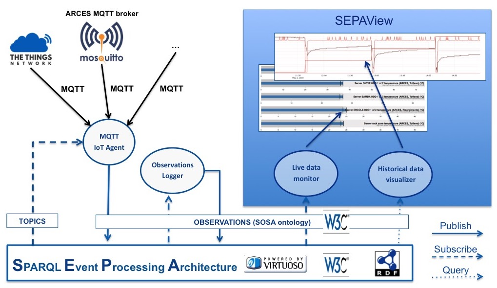

The core element is the MQTT IoT Agent that will be detailed later on. 

Real-time and historical data visualization is provided by the [SEPAView](https://github.com/arces-wot/SEPAview) web application. 

[Here](http://mml.arces.unibo.it/swamp/sepaview/latest/) you can see a demonstration which includes data for smart farming (e.g., soil moisture, canals levels, weather conditions)  within the [SWAMP project](http://swamp-project.org/), as well as, data for server health monitoring (e.g., CPUs and HDDs temperature, server room temperature and humidity, external temperature) of the [ARCES](http://www.arces.unibo.it/en) infrastructure.

## Ontology
Data collected from the pool of MQTT brokers are represented according to the [W3C SOSA ontology](https://www.w3.org/TR/vocab-ssn/).

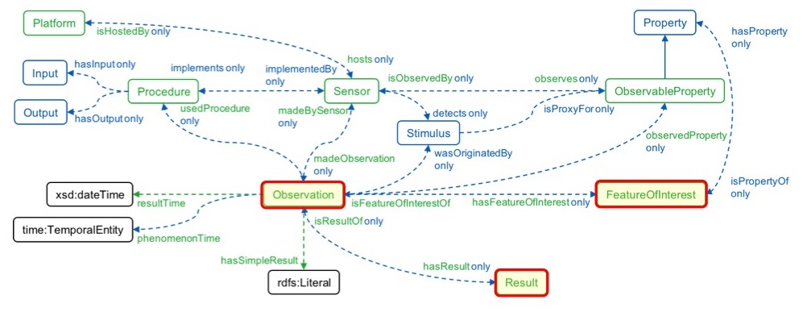

SOSA `observations` are then contextualized as `places` according to the [Schema.org](https://schema.org/) ontology. The knowledge graph is partitioned in several named graphs which include the graph for real-time data and the graph for historical data. Other graphs contain triples for the mapping of MQTT messages into observations.

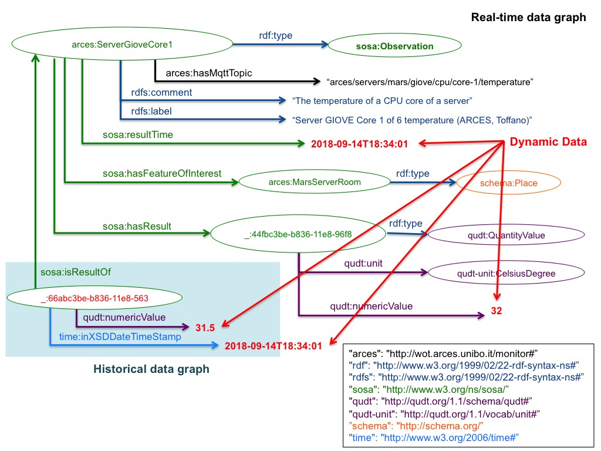

## MQTT IoT Agent
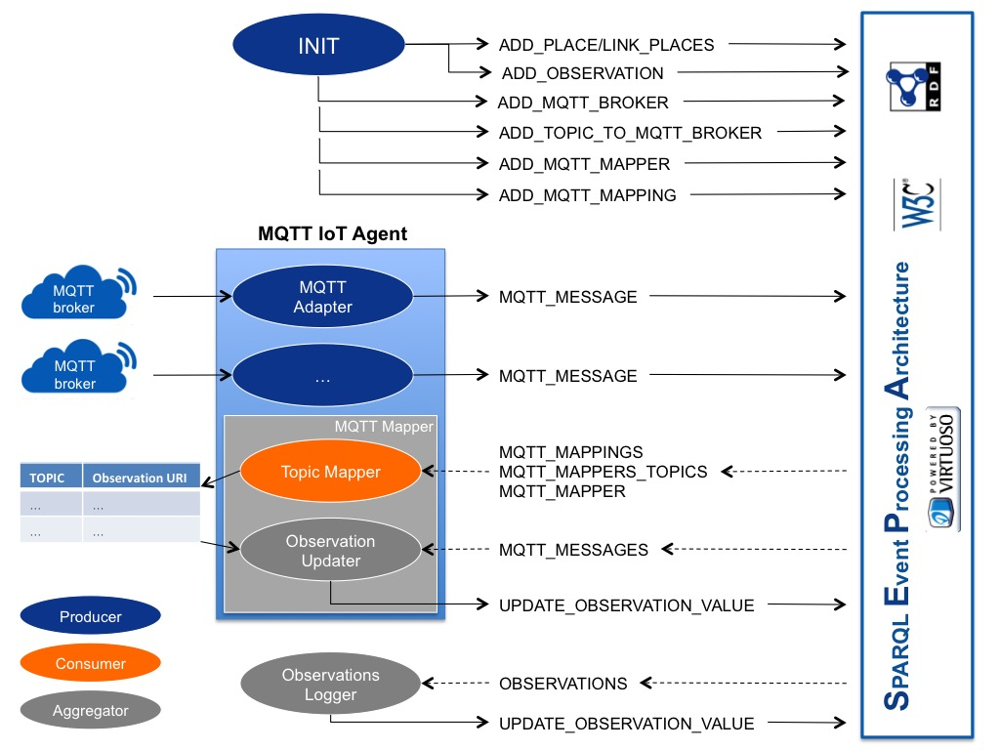

The agent is composed by a set of `MQTT Adapters`, one for each `MQTT Broker`. Adapters can be created and disposed on the fly. The role of an updater is to update the knowledge graph with the messages received from an MQTT broker. A message includes an `identifier` of the broker (i.e., URL + PORT), the `topic` and the `value`. The topics which an adapter is subscribed to can be added and removed on the fly.

The `Observations Logger` stores historical data which are represented as SOSA results related to a specific observation.

## MQTT to SOSA mapping
The mapping from MQTT messages (topic-value) to observations is performed by a set of `MQTT Mappers`. Each mapper implements the mapping function which is specific of each topic. A default mapper is provided to map MQTT messages where the topic corresponds 1:1 with an observation and the value is the numeric value of the observations. In all the other cases, a specific mapper should be implemented. 

Let's consider the following example. A broker sends a message with the topic `transmission_example/devices/new_device/up` and the following JSON as value:

```json
{"app_id":"transmission_example",
"dev_id":"new_device",
"hardware_serial":"00A76EC32F31EC32",
"port":2,
"counter":29,
"is_retry":true,
"payload_raw":"GgF3fAUWRgEAA3cANBcKAQAGdwA0FlABAFU=",
"payload_fields":{
	"battery":85,
	"sensor_1":{"Conductivity":1,"Permittivity":124.05,"Temperature":22.7},
	"sensor_3":{"Conductivity":1,"Permittivity":0.52,"Temperature":23.1},
	"sensor_6":{"Conductivity":1,"Permittivity":0.52,"Temperature":22.8}},
"metadata":{
	"time":"2019-10-22T09:39:48.884897323Z","frequency":868.1,"modulation":"LORA","data_rate":"SF12BW125","airtime":1974272000,"coding_rate":"4/5",
	"gateways":[{"gtw_id":"eui-0ceee6fffe9da82e","timestamp":2163472228,"time":"2019-10-22T09:39:47.432111Z","channel":0,"rssi":-101,"snr":0.8,"rf_chain":1,"latitude":44.48148,"longitude":11.33012,"altitude":235}]}}
```
The message carries information about 10 observations: the % of `battery` and the `conductivity` (dS/m), `permittivity` (no dimension) and `temperature` (°C) measured by 3 sensors. As first step the mapper builds 10 different topics, one for each observations. The topics look like the following:

```
transmission_example/devices/new_device/up/battery

transmission_example/devices/new_device/up/sensor_1/Conductivity
transmission_example/devices/new_device/up/sensor_1/Permittivity
transmission_example/devices/new_device/up/sensor_1/Temperature

transmission_example/devices/new_device/up/sensor_3/Conductivity
transmission_example/devices/new_device/up/sensor_3/Permittivity
transmission_example/devices/new_device/up/sensor_3/Temperature

transmission_example/devices/new_device/up/sensor_6/Conductivity
transmission_example/devices/new_device/up/sensor_6/Permittivity
transmission_example/devices/new_device/up/sensor_6/Temperature
```
The mapper then needs to know which is the observation URI to be associated with each topic. These mappings are all stored in the knowledge graph and the mapper is subscribed to their changes. Eventually, the mapper updates each observation with the value extracted from the above JSON (e.g., 85 % for the battery).

## MQTT IoT Agent configuration
The agent configuration parameters are all store in the knowledge graph and the agent is subscribed to them. A generic configuration process consists of one or more of the following steps. All the steps can be performed using the SEPA Dashboard, available as [Java application](https://github.com/arces-wot/SEPA-Dashboard) or [web application](https://github.com/arces-wot/SEPA-Dashboard---bs). An online version is available [here](http://mml.arces.unibo.it/apps/dashboard/). The JSAP files to be used can be found within the resource files.

##### Add an MQTT broker
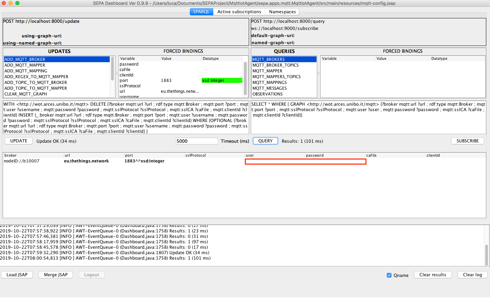
##### Add a topic to an broker
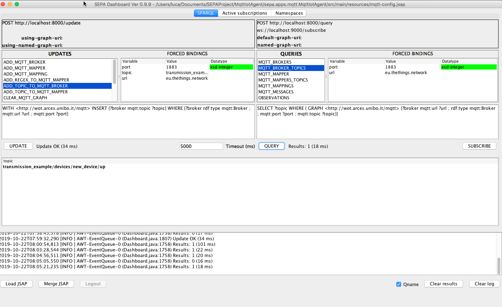
##### Add a mapper
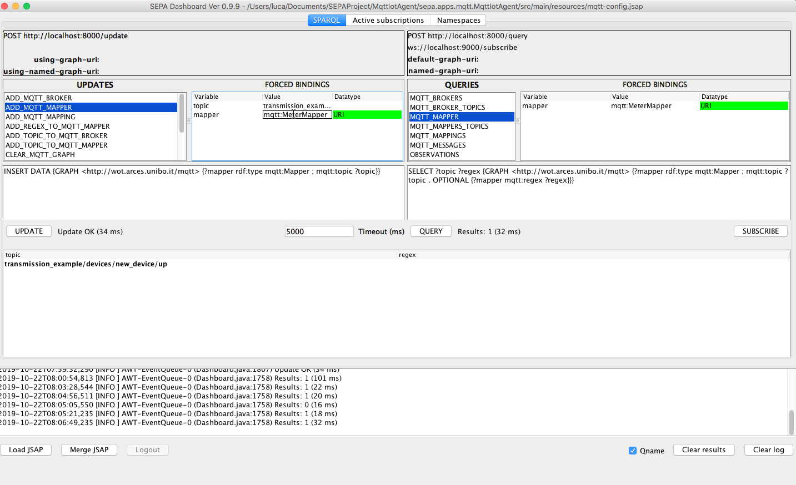
##### Add a mapping
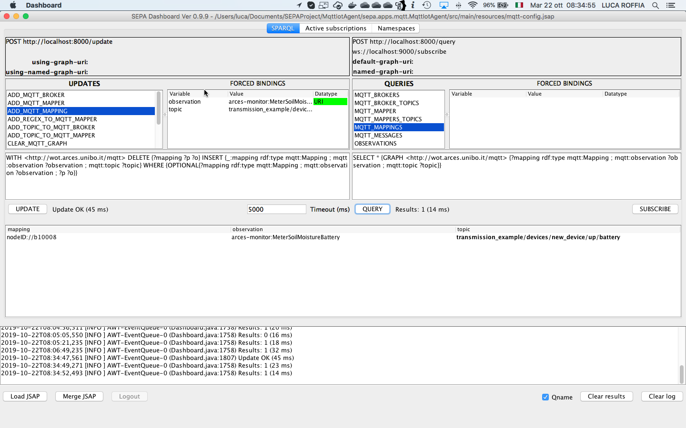
#### Setting the context

##### Add an observation
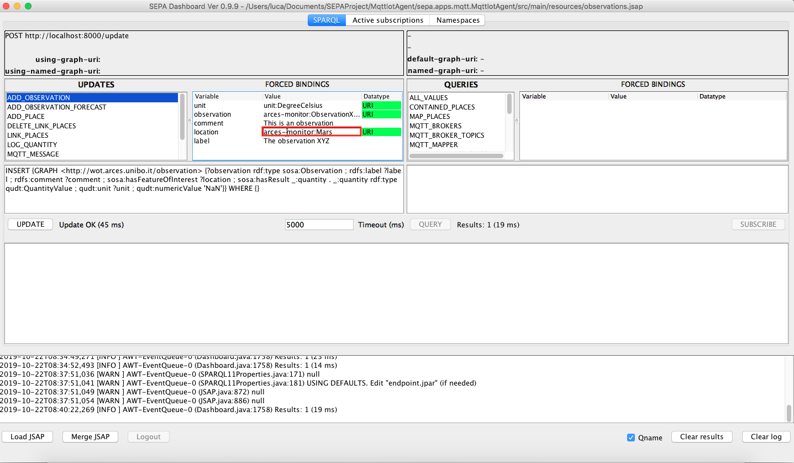
##### Add a place
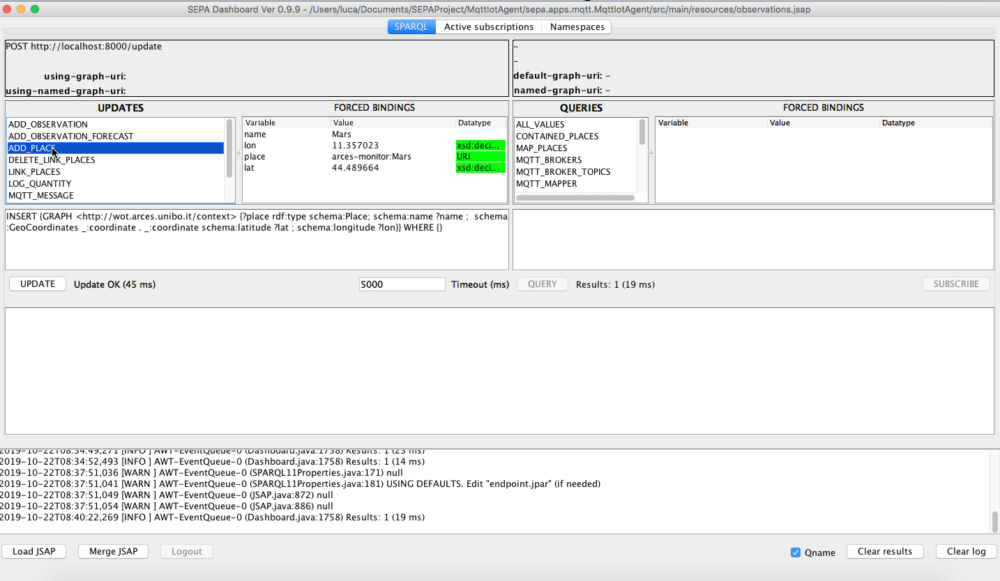
##### Nesting places
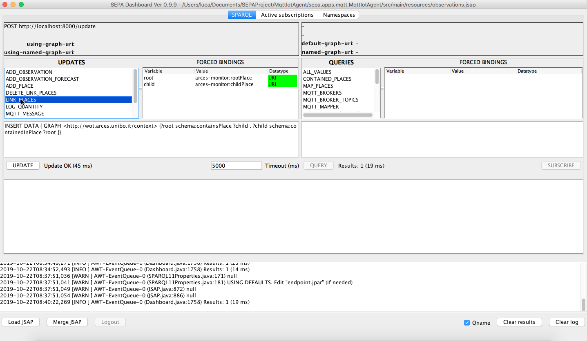